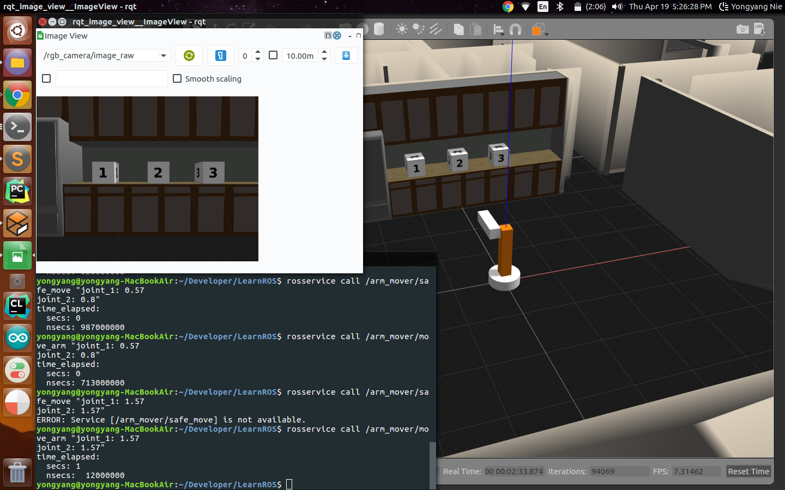

# LearnROS
This repo is about learning ROS (Robot Operating System). The materials are from the Udacity self-driving car Nanodegree

## Details
Below are the lessons/tutorials in this repo:
- ROS publishers
- ROS services
- ROS subscribers
- ROS launch & logging

## Credit
Thanks to Udacity and Michael Meng
Developed and maintained by Neil Nie

| [Email](mailto:yongyang.nie@gmail.com) | [Website](https://neilnie.com)
